<!--
  - SPDX-FileCopyrightText: 2026 Nextcloud GmbH and Nextcloud contributors
  - SPDX-License-Identifier: AGPL-3.0-or-later
-->
# Absence 🌴

A vacation-approval workflow for Nextcloud: employees apply for leave, line managers
approve or reject, and HR gets a company-wide overview with statistics and exports.

Built to the specification in [SPECIFICATION.md](./SPECIFICATION.md).

## Features

- **Apply** for annual, sick, unpaid or special leave (configurable types) with a live
  balance preview from the manually entered working-day count.
- **Approve / reject** as a line manager, with team-coverage conflict warnings.
- **Escalation**: pending requests a manager ignores are automatically escalated to HR.
- **Full balance tracking**: entitlement, used, pending, remaining and carry-over,
  with a configurable year-rollover policy. *My leave* shows each balance as an
  animated ring with a breakdown ledger (base + carry-over ± adjustment → available)
  and monthly charts of leave taken and sick days for the current year.
- **HR area**: per-employee balances, company-wide statistics, a who's-off calendar,
  and CSV export.
- **Calendar sync**: approved leave is written to a personal and a shared team calendar
  via CalDAV.
- **Notifications, email and activity** for every step.
- Native Nextcloud UI (Vue 3 + `@nextcloud/vue`), dark-mode aware, translatable.

## Screenshots

### Employee

**My leave** — next-break hero, balance ring with breakdown ledger, monthly leave & sick-day charts, and the request list:

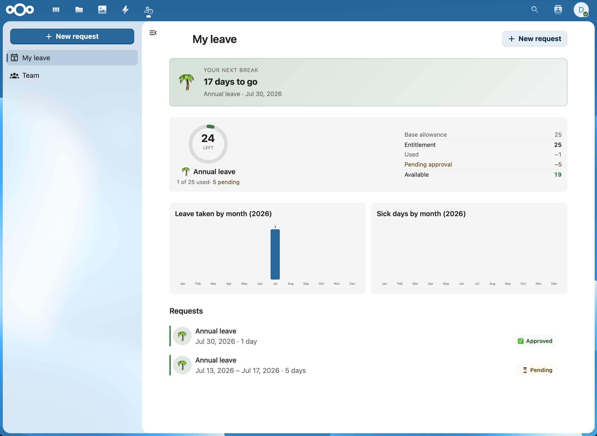

**Request time off** — leave type, replacement picker, dates and manually entered working days:

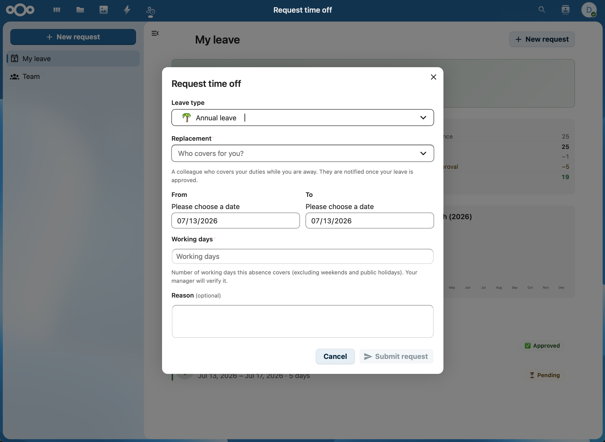

**Dashboard widget** — balance summary, upcoming leave and (for managers) requests awaiting a decision:

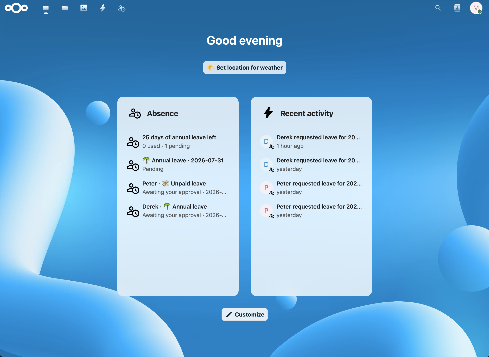

### Line managers

**Approving a request** — detail sidebar with progress stepper, coverage and history:

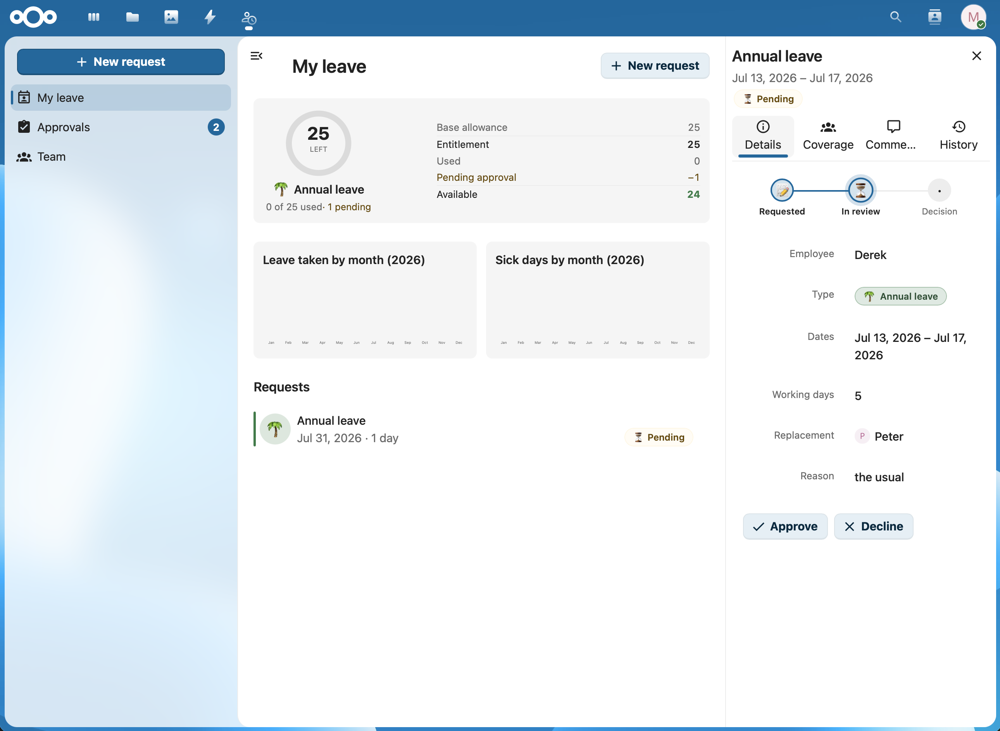

**Team timeline** — who's off this month, pending requests hatched:

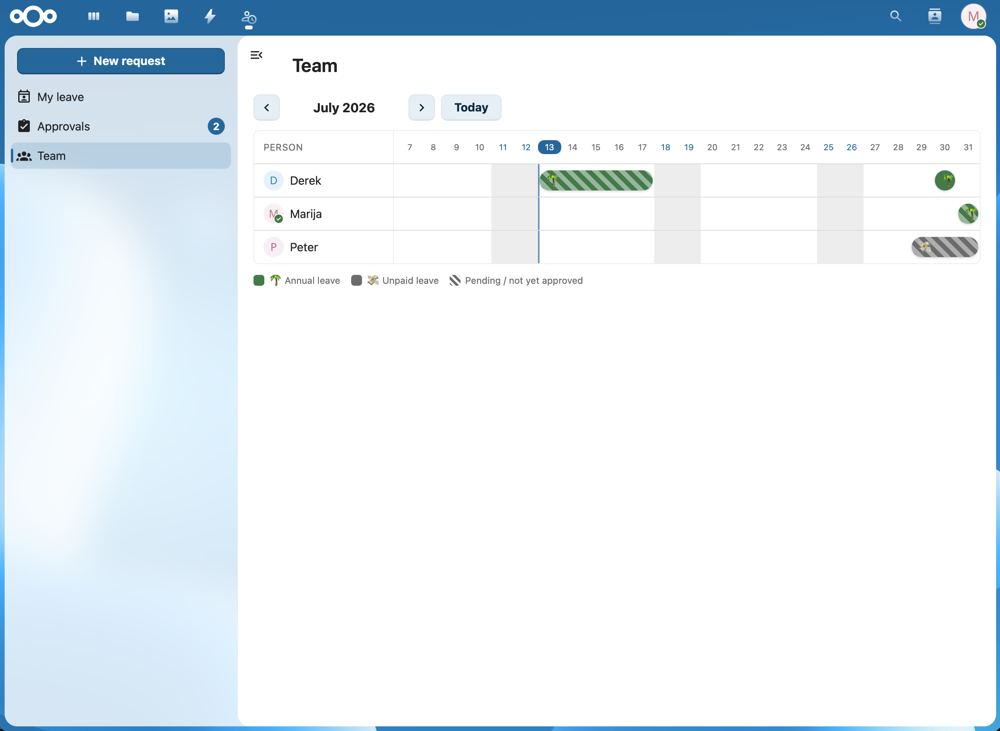

### HR

**Record absence** — book sick leave (or any type) for an employee directly, without an approval step:

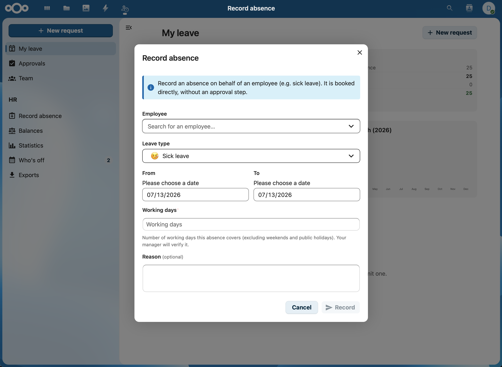

**Balances** — per-employee entitlement, used, pending, remaining and available:

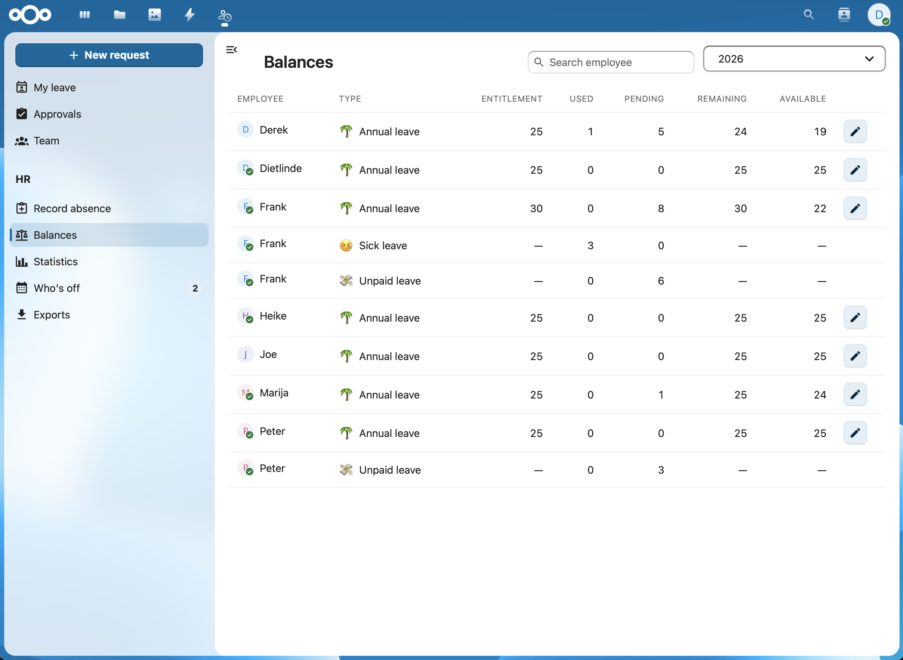

**Edit entitlement** — base days plus a manual adjustment with a note:

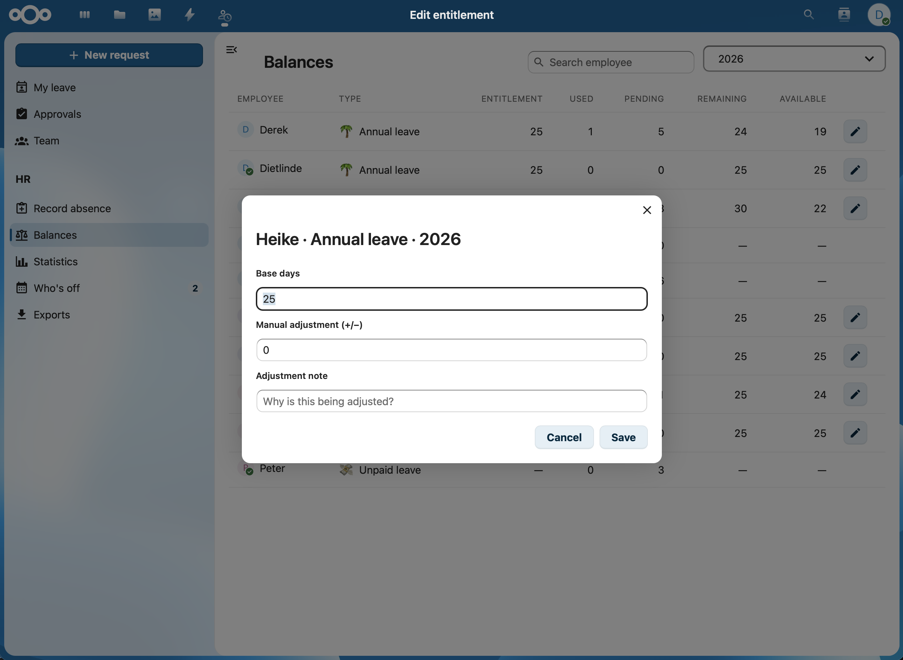

**Who's off** — company-wide absence timeline:

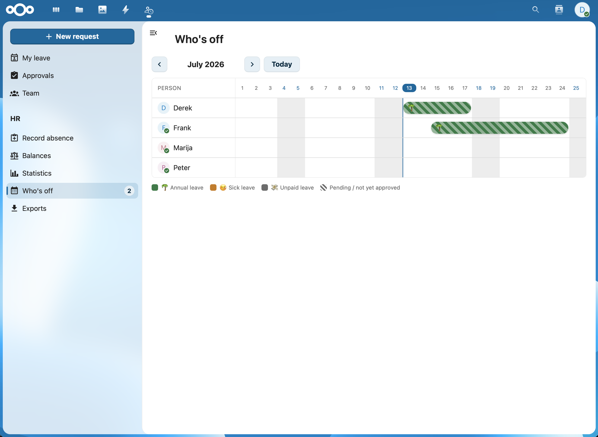

**Statistics** — stat tiles, absence-days trend and days by leave type:

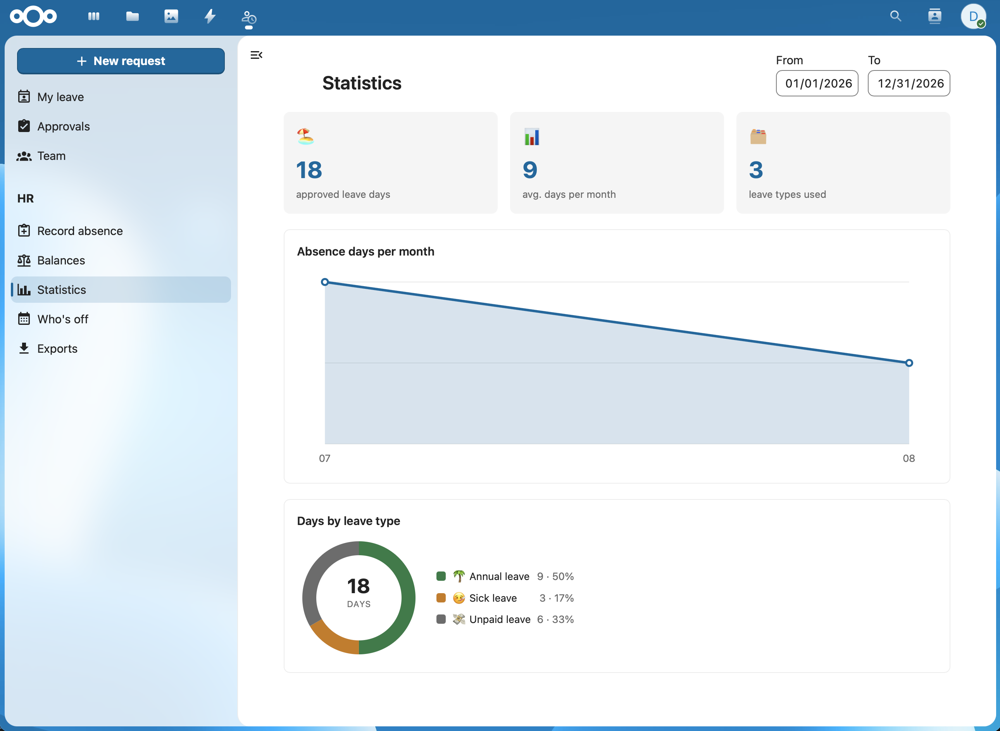

**Exports** — leave requests and balances as CSV:

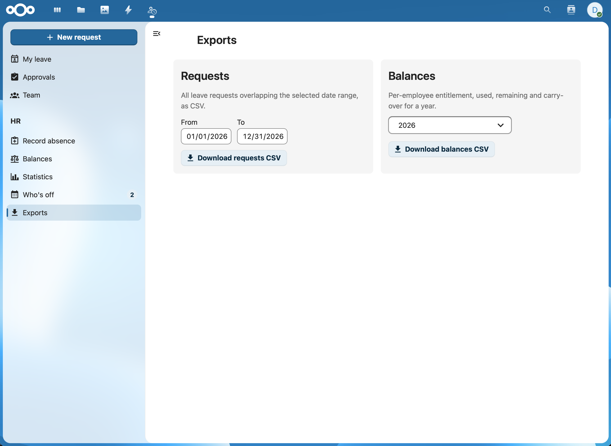

**Requesting leave works the same from the HR area:**

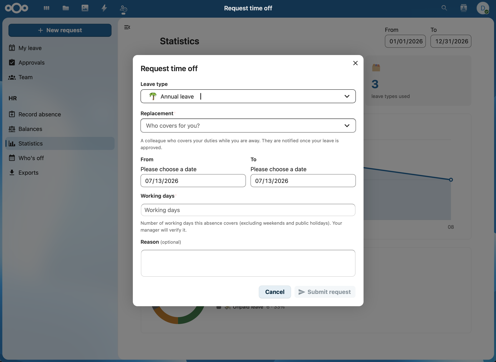

### Administration

**Admin settings** — HR group, entitlements, escalation, carry-over policy and CalDAV targets:

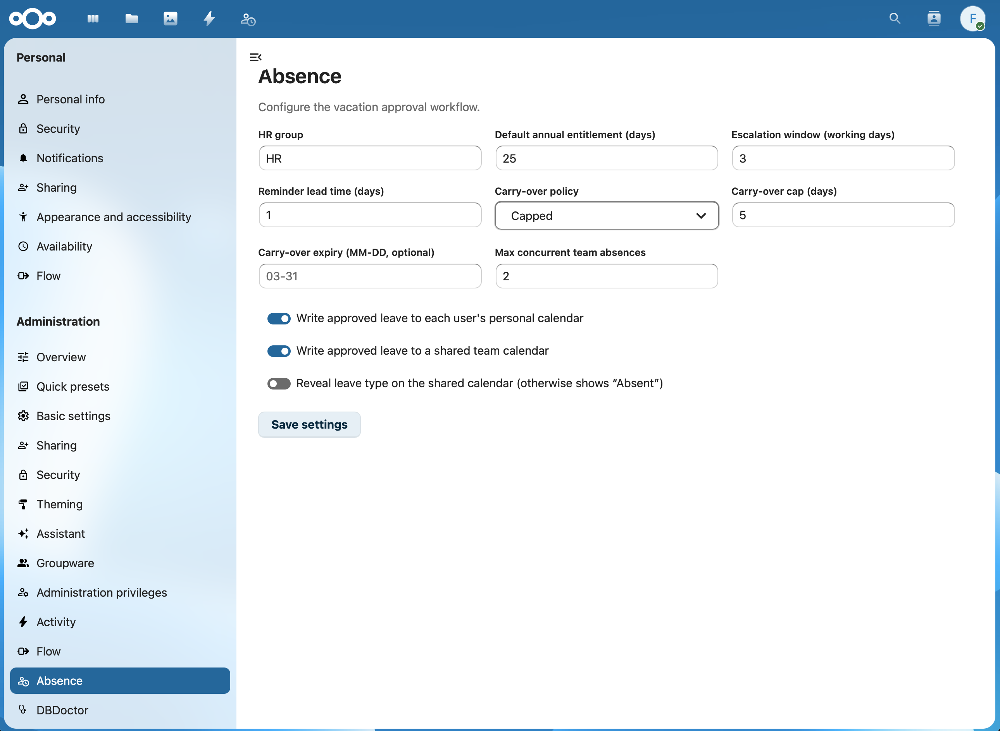

## Roles

| Role | How it's assigned |
|------|-------------------|
| Employee | every user |
| Line manager | the account `manager` property (from LDAP or set on the account) |
| HR | membership of a configurable group (default `hr`, see admin settings) |
| Admin | Nextcloud server admins configure the app |

## Architecture

- **Backend** — PHP on the Nextcloud App Framework:
  - `lib/Db` — entities + QBMappers (`absence_requests`, `absence_leave_types`,
    `absence_entitlements`, `absence_comments`, `absence_request_events`).
  - `lib/Service` — the domain logic. `RequestService` owns the state machine;
    `BalanceService`, `CoverageService`, `EntitlementService`,
    `CalendarService`, `NotificationService`, `ReportService`, `ExportService`,
    `PermissionService`, `ManagerResolver`, `ConfigService`, `SessionService`,
    `ActivityPublisher`.
  - `lib/Controller` — thin JSON controllers behind `appinfo/routes.php`.
  - `lib/BackgroundJob` — `EscalationJob` (hourly), `ReminderJob` (daily),
    `YearRolloverJob` (daily, idempotent per year).
  - `lib/Notification`, `lib/Activity`, `lib/Settings`, `lib/Listener`, `lib/Migration`.
- **Frontend** — Vue 3 SPA in `src/`, built with `@nextcloud/vite-config` into `js/`.

## Development

```bash
# PHP: lint / static analysis / tests (run from the server root or here)
composer install
composer cs:check
composer psalm

# Frontend
npm install --legacy-peer-deps   # ecosystem peer ranges require this flag
npm run build                    # → js/absence-*.mjs, css/*
npm run watch                    # rebuild on change during development
```

Enable the app:

```bash
occ app:enable absence
```

The default leave types (annual, sick, unpaid, special) are seeded on install.

## Configuration

Admin settings live under **Administration settings → Absence** (HR group, default
entitlement, escalation window, carry-over policy, coverage threshold, CalDAV targets).
There are **no personal settings** — working days are entered manually per request
(no per-user holiday region), and notification preferences defer to the global
Nextcloud notification settings.

## Audit logging

Every important action — request created / edited / approved / rejected / cancelled,
withdrawal requested/approved/rejected, escalation, comments, entitlement changes,
carry-over rollover/expiry, leave-type and holiday changes, admin-config changes, and
GDPR user-data purge — is written to **`nextcloud.log`** as a structured JSON entry
tagged `"app":"absence"` with a machine-readable `action` and full context (actor,
request id, employee, type, dates, working days, status).

These entries are **always written regardless of the instance log level**: on install
(and every update) the app adds `absence` to the system `log.condition.apps` list,
which Nextcloud honours by forcing DEBUG-level capture for the app's tagged messages.
The existing condition is merged, never replaced, and the entry is removed again on
uninstall. Filter the log with e.g. `grep '"app":"absence"' nextcloud.log` or by a
specific `"action"`.

## Status vs. specification

Phase 1 (per the spec's "definition of done") is implemented, plus a role-aware
**Dashboard widget**: every employee sees their own balance and upcoming/pending
leave, line managers additionally see team requests awaiting their decision, and HR
sees the escalated queue across the company. Phase-2 items — file attachments for
doctor's notes, ICS holiday import, and half-day granularity — are intentionally left
as follow-ups; the schema already reserves room for half-days.
