<!--
  - SPDX-FileCopyrightText: 2026 Nextcloud GmbH and Nextcloud contributors
  - SPDX-License-Identifier: AGPL-3.0-or-later
-->
<div align="center">

# Absence 🌴

### Vacation approval that lives where your company already works

**Employees apply. Managers approve in one click. HR sees everything.**
No spreadsheets, no per-seat SaaS bill, no employee data leaving your server.

[](https://nextcloud.com)
[](LICENSE)
[](./SPECIFICATION.md)

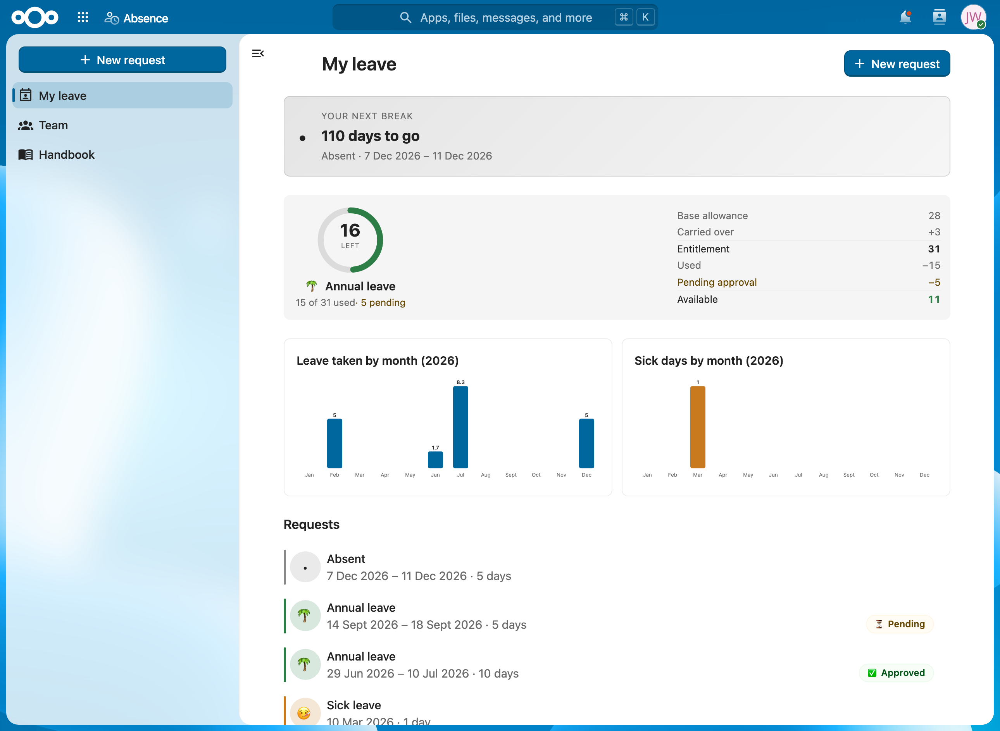

</div>

---

## Why a leave app on Nextcloud

Leave management is one of the few HR processes that touches **every** employee,
every year — and it is usually the one still run on a shared spreadsheet, an email
thread, or a €4-per-user-per-month product that wants your entire staff directory.

Absence puts it on infrastructure you already run and already trust:

- **Your data stays on your server.** Who is off, who is sick, and why they asked —
  none of it is replicated to a third party. For many companies that alone decides
  the question.
- **No per-seat licence.** AGPL-3.0, free for as many employees as you have.
- **It already knows your company.** Employees are your Nextcloud users, HR is a
  Nextcloud group, and line managers come from the `manager` account property your
  LDAP or Active Directory already fills in. There is no second org chart to
  maintain and no import to keep in sync.
- **It lands where people already look.** Approvals arrive as Nextcloud
  notifications and email, approved leave appears in Nextcloud Calendar, and the
  balance sits on the Nextcloud dashboard. Nobody has to remember a new tool exists.
- **It is auditable by design.** Every decision is written to the request's own
  history, the Activity feed, and `nextcloud.log` — always, regardless of your log
  level.

---

## Contents

- [At a glance](#at-a-glance)
- [On the dashboard](#on-the-dashboard)
- [For employees](#for-employees)
- [For line managers](#for-line-managers)
- [For HR](#for-hr)
- [For administrators](#for-administrators)
- [Roles](#roles)
- [Privacy, security & compliance](#privacy-security--compliance)
- [Requirements & installation](#requirements--installation)
- [Configuration](#configuration)
- [Audit logging](#audit-logging)
- [What is not in the box](#what-is-not-in-the-box-yet)
- [Architecture](#architecture)
- [Development](#development)

---

## At a glance

| | |
|---|---|
| 🌴 **Leave types you define** | Annual, sick, unpaid and special leave are seeded; add your own with colour, emoji, and flags for balance-counting, approval, mandatory note and mandatory replacement |
| ⚖️ **Real balance tracking** | Entitlement, used, pending, remaining, carry-over and manual adjustments — per employee, per type, per year |
| ✅ **One-click approval** | Approve straight from the notification, without opening the app |
| ⏰ **Nothing gets stuck** | Ignored requests are reminded, then escalated to HR — immediately when the app knows the manager is on leave themselves |
| 📎 **Attachments** | Doctor's notes and other documents on the request — visible to HR and the employee, never the manager |
| 👥 **Coverage warnings** | Both the employee booking and the manager approving are told who else is already off |
| 📅 **Calendar sync** | Approved leave written to the employee's personal calendar and a shared team calendar over CalDAV |
| 🔔 **Four channels** | Notification, email, Activity feed and audit log — carrying what people actually wrote |
| 📊 **HR overview** | Company-wide balances, statistics, sick-leave ranking, who's-off timeline and CSV export |
| 🔁 **Year rollover** | Carry-over computed automatically, with a cap and an optional expiry date |
| 🌍 **Localised** | Every string translatable; dates, numbers and week-start follow the user's locale |
| 🌗 **Native and beautiful** | Vue 3 built on `@nextcloud/vue`, so it looks and behaves like the rest of your Nextcloud — dark-mode aware, and every animation stops under `prefers-reduced-motion` |

---

## On the dashboard

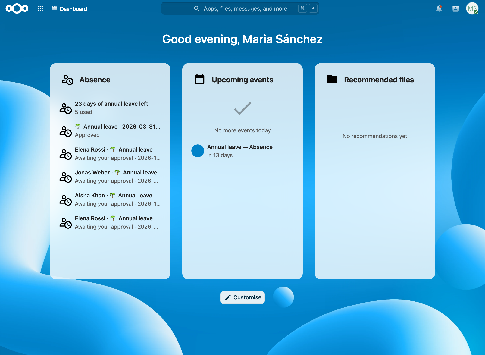

Most people should not have to open a leave app to use one. The **dashboard widget**
is role-aware and shows each person exactly what is theirs to know: every employee
sees their balance and upcoming leave, line managers additionally see the requests
waiting on their decision, and HR sees the escalated queue across the company.

For a lot of employees, that widget *is* the app — right next to their files and
calendar, on the page they already open every morning.

---

## For employees

> *"How many days do I have left, and can I take them in August?"* — answered on one
> screen, in about three seconds.

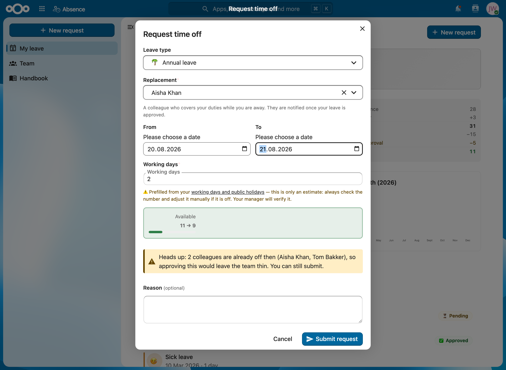

**Booking leave takes four fields and tells you everything you need before you send
it.** Pick a type and a date range, and the app:

- **prefills the working-day count** from your availability and your country's public
  holidays — weekends and bank holidays are already excluded, and the number stays
  editable because only you know about that Tuesday you owe the office;
- shows a **live balance preview** — `18 → 13 days available` with a fill bar — so you
  never submit blind;
- **names the colleagues already off** during those dates while you can still cheaply
  pick different ones, and warns you if booking would leave the team thin;
- warns — but never blocks — if you would go past your balance. HR may still approve
  it, and the app does not pretend otherwise;
- remembers the **replacement colleague** you nominated last time.

A built-in **handbook** sits in the sidebar for every employee and team lead —
and HR gets an extended edition covering their whole toolset — so "how does this
work?" never needs to leave the app.

**My leave** is the home screen: a *next break* hero that counts the days down — and
ticks second by second over the final 48 hours — above one animated **balance ring**
per leave type, each with a full breakdown ledger (base + carry-over ± adjustment →
available), monthly charts of leave taken and sick days, and your request history.

You can **edit or cancel** a pending request outright. Withdrawing leave that has
already been approved politely asks your manager first, because they planned around it.

---

## For line managers

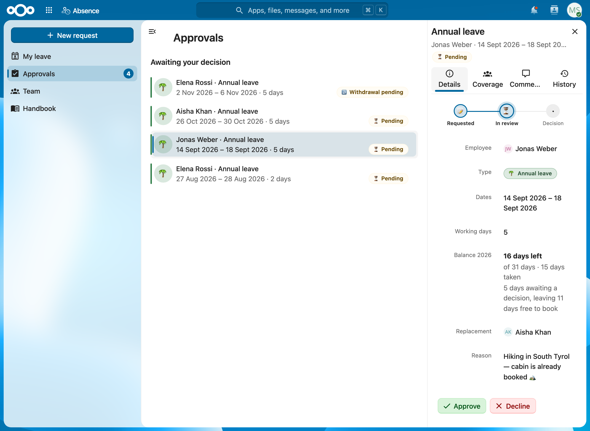

**The common answer costs one click.** A request arrives as a Nextcloud notification
with **Approve**, **Decline** and **Review** buttons; approving happens in place and
the notification disappears. Declining opens the request with the reason box ready —
because a decline needs a reason, and a manager should not be able to reject somebody's
holiday from a toast without giving one.

When you do open a request, the sidebar gives you the whole picture:

- a **progress stepper** — Requested → Review → Approved / Declined / Withdrawing;
- a **coverage panel**: exactly who else on the team is off during those dates, and a
  warning when approving would take the team to the concurrent-absence limit you set;
- a **short-notice warning** when the leave starts sooner than the notice period your
  company expects — leading the notification, the email subject line and the Details
  tab, because how little warning you were given bears on the answer;
- the employee's **reason**, the full **comment thread**, and a complete **history**
  of every edit, escalation and decision.

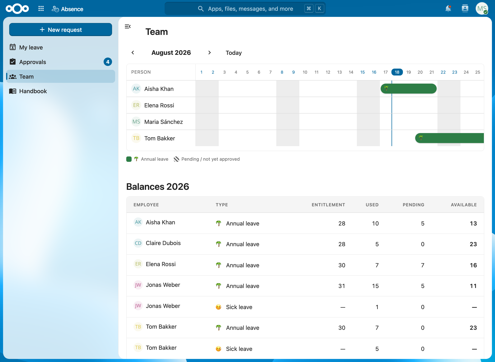

**Team timeline** is a Gantt-style month view of your direct reports: continuous
leave pills, hatched while still pending, with weekend shading and a *today* line —
the view you want open when somebody asks "can I take that week?" Below it, a
**team balances table** shows each report's entitlement, used, pending and available
days for the current year — the other half of "can I take that week?", answered on
the same screen.

Everything a manager needs sits on the request itself — coverage, notice, reason,
history — so approving never means going looking for context elsewhere.

---

## For HR

HR sees the whole company and can correct anything — with every correction on the record.

### Every absence, filterable and correctable

Filter by employee, leave type, status and year. Selecting a record opens the same
detail sidebar, where HR can fix the dates, type or working days, or cancel it.
**Cancelling keeps the record and its history** for the audit trail — there is
deliberately no delete.

### Confidential categories, HR-only

**Maternity leave**, **parental leave**, **child sick leave**, **medical work
prohibition** and **doctor's note** ship as confidential categories: when HR picks *Sick leave* in the Record absence dialog,
a *Category* selector appears offering them (general sick leave being the
default). Only HR ever sees what they are.
To the line manager and even in the employee's own app, such an absence is a
neutral *"Absent"* — dates and status, no category, no notes. The team timeline
and coverage warnings still count the absence (colleagues plan around the person
being away, not the reason), the shared calendar says *"Absent"* even when the
admin chose to reveal ordinary leave types, and non-HR browsers never receive so
much as the category names. Enforced by the API, not merely hidden in the UI.

### Record absences directly

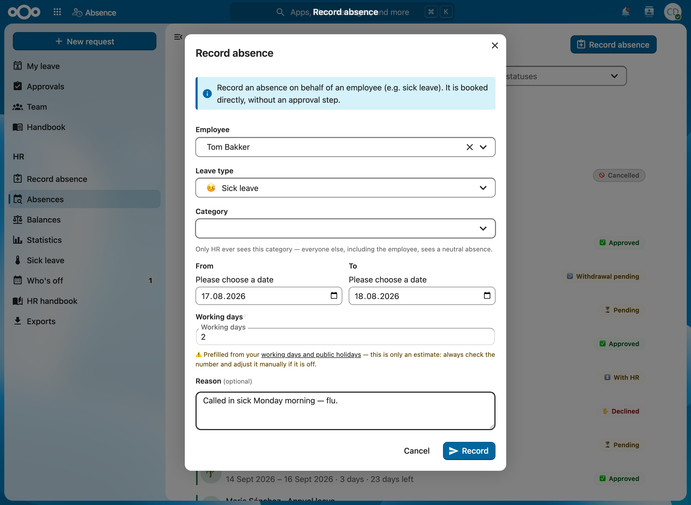

Sick leave is not something anyone applies for in advance. HR books it (or any type)
on an employee's behalf, straight to approved, with no approval step — and the
employee, their manager and their replacement are told.

### Onboarding from a spreadsheet

`occ absence:import-entitlements balances.csv --dry-run` validates and imports
current entitlements (base days, carry-over, adjustments with notes) in one
audited, all-or-nothing pass — uids or e-mail addresses, comma- or
semicolon-separated, straight out of Excel.

### Balances and entitlements

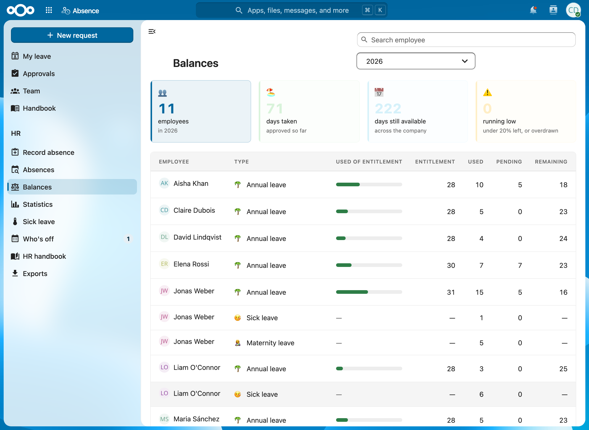

Per-employee entitlement, used, pending, remaining and available, per year and type,
filterable by group. Set entitlements individually or **in bulk for a whole group**.

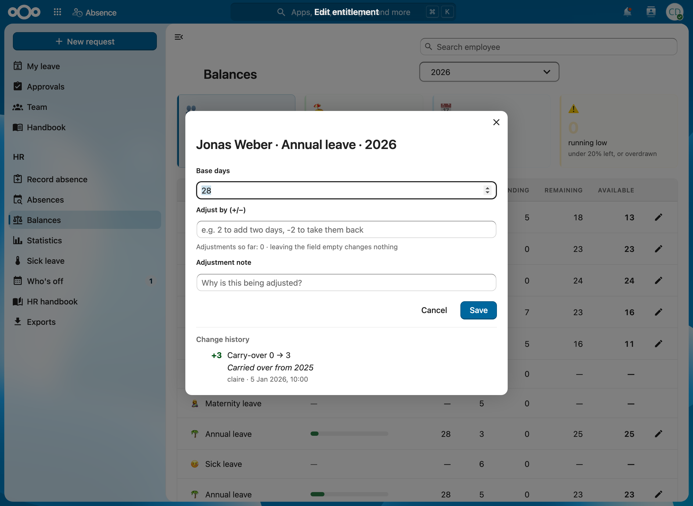

Every entitlement is a **base allowance plus an explicit adjustment with a note**, so
"why does Ada have 27 days?" always has an answer written down next to the number.

### Statistics

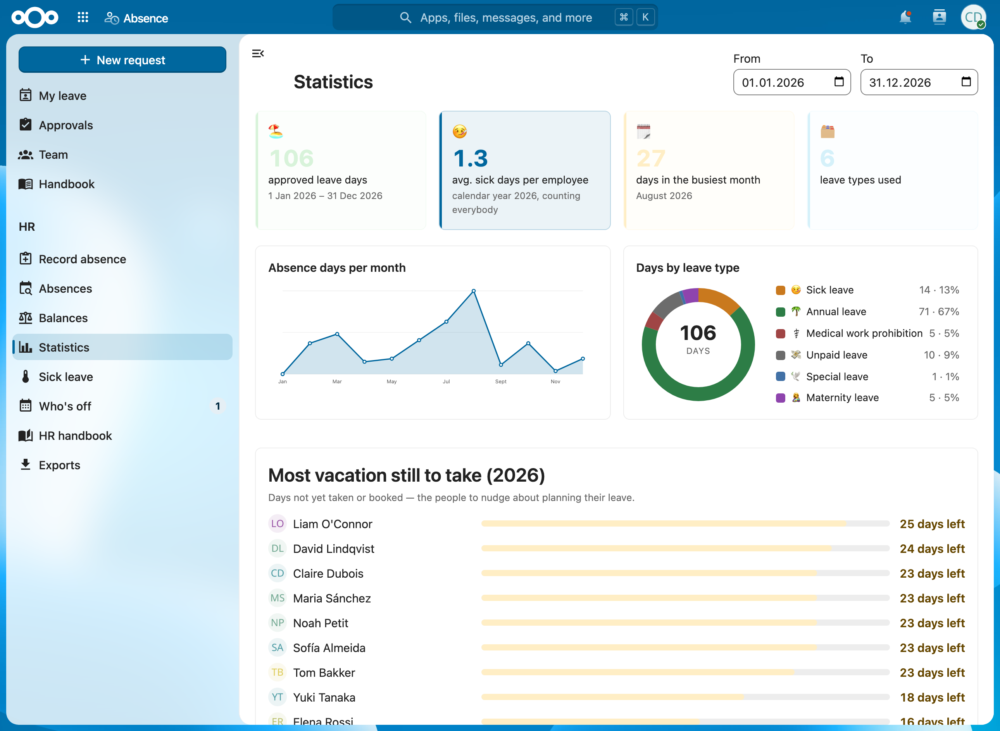

Stat tiles — approved leave days, **average sick days per employee across the
calendar year**, the busiest month, leave types used — plus an absence-days trend
over time and days by leave type: hand-written, theme-aware SVG charts that follow
your Nextcloud theme and look right in dark mode, with no charting dependency
shipped. A **"most vacation still to take"** list ranks who has the most unplanned
days left in the year (flagging anyone with more than half their entitlement
untouched), so nudging people to plan their leave takes one glance. A separate
**sick-leave overview** ranks employees by days lost for a chosen year and drills
down to the individual days.

### Insights

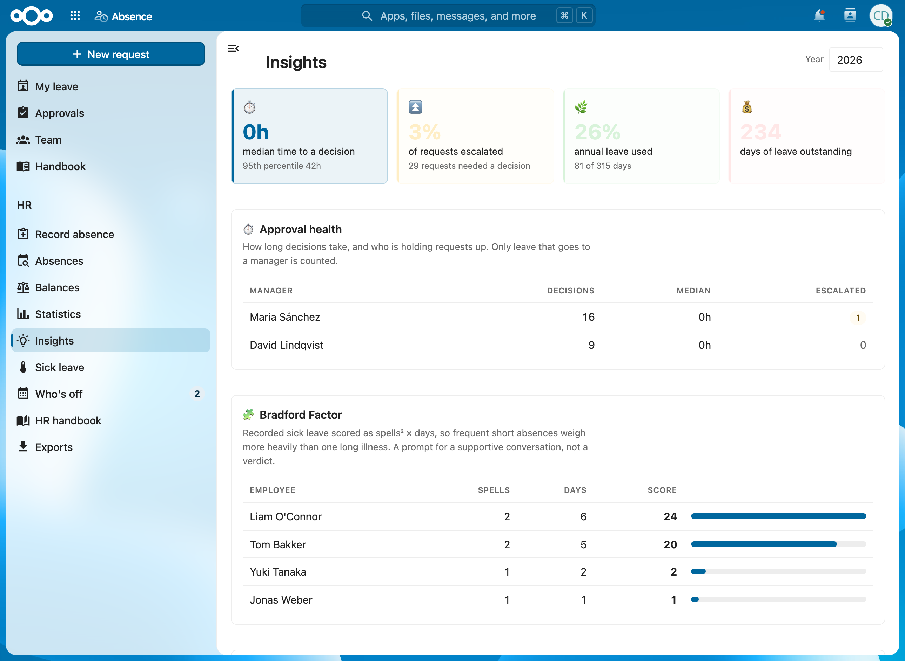

Where *Statistics* describes what happened, **Insights** is diagnostic. **Approval
health** shows the median (and 95th-percentile) time from request to decision and
which managers hold requests up or keep escalating. The **Bradford Factor** scores
recorded sick leave as spells² × days — the long-standing HR measure that weights
frequent short absences more heavily than one long illness — as a prompt for a
supportive conversation. **Leave utilisation** shows how much of their entitlement
people actually take, per team, with a watchlist of anyone who has not been off in a
while (an early burnout signal). **Leave liability** totals the accrued-but-untaken
leave carried on the books and the carry-over about to expire. HR-only, like every
report here.

### Who's off, company-wide

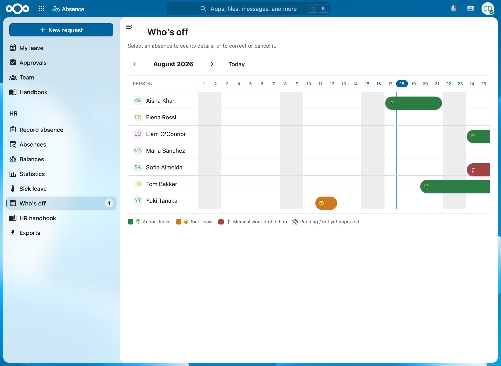

The same timeline as the team view, across the entire organisation — and each pill
opens the record behind it.

### Export

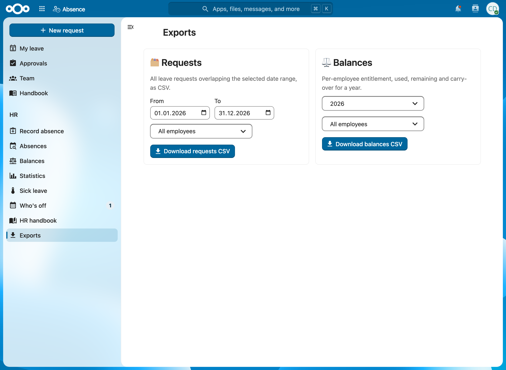

Leave requests and balances as CSV, with date-range and group filters, for payroll or
an external HR system.

**And HR requests their own leave like everybody else:**

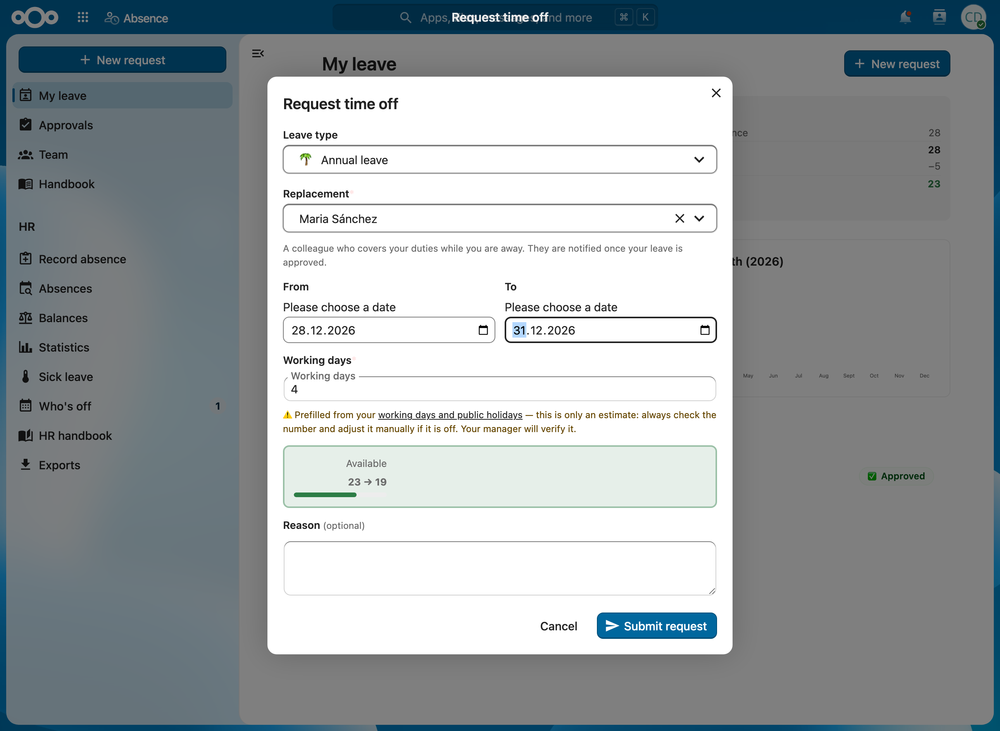

---

## For administrators

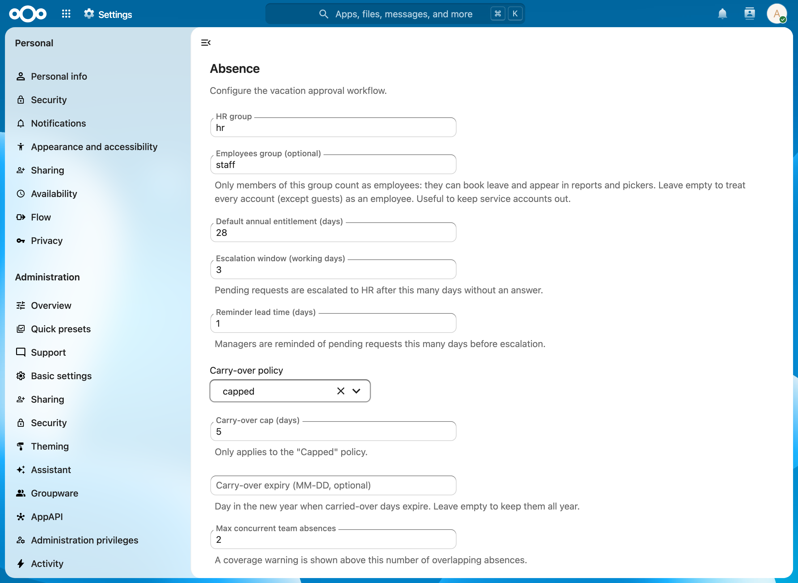

Everything is configured from **Administration settings → Absence** — a declarative
settings form, so there is no bespoke admin UI to learn.

| Setting | Default | What it does |
|---|---|---|
| HR group | `hr` | Which Nextcloud group holds HR powers |
| Employees group | empty (= everyone) | Optional: only members of this group count as employees — keeps service accounts out of leave, reports and pickers. Recommended on large instances: reports then read one group instead of enumerating the whole user directory |
| Default annual entitlement | 28 days | Seed for new entitlement rows |
| Escalation window | 3 working days | How long a manager may sit on a request before HR is pulled in |
| Reminder lead time | 1 day | How long before escalation the manager is nudged |
| Carry-over policy | `capped` | `none`, `unlimited` or `capped` |
| Carry-over cap | 5 days | Used when the policy is `capped` |
| Carry-over expiry | none | Optional date (e.g. 31 March) after which carried days are zeroed |
| Max concurrent team absences | 2 | The coverage-warning threshold |
| Expected notice period | 14 calendar days | Short-notice threshold; `0` switches it off |
| CalDAV: personal events | on | Write approved leave to the employee's own calendar |
| CalDAV: shared team calendar | on | Write approved leave to a shared company calendar |
| Shared calendar type-visibility | neutral | Whether colleagues see *"Absent"* or *"Sick leave"* |
| Leave types | seeded | Add, edit, enable or disable types, with colours and flags |

**Three background jobs** keep it running unattended, all idempotent and safe to
re-run: escalation (hourly), reminders (daily) and the year rollover (daily, acting
once per year).

**Personal settings** are deliberately tiny: a small section appended to the built-in
**Availability** page that feeds the working-day prefill (working weekdays, and a
country/region for public holidays). Notification preferences defer to Nextcloud's own.

---

## Roles

| Role | How it is assigned | What it unlocks |
|---|---|---|
| **Employee** | every user account | Apply for leave, see own balances and history |
| **Line manager** | the `manager` account property, from LDAP/AD or set on the account | Approve/decline reports' requests, team coverage, timeline and balances |
| **HR** | membership of a configurable group (default `hr`) | Company-wide view, record and correct absences, entitlements, statistics, export |
| **Administrator** | Nextcloud server admin | App configuration and leave types |

Guest accounts are **not** employees: they have no entitlement, take no leave, appear
in no report or picker, and cannot be nominated as a replacement — enforced by the
API, not merely hidden in the UI.

---

## Privacy, security & compliance

Built for a European works council to be comfortable with:

- **Authorisation on every endpoint**, centralised in one `PermissionService` — an
  employee reads only their own data, a manager only their reports', HR everything.
  Enforced server-side; the UI merely reflects it.
- **Confidential categories.** Maternity leave, parental leave, child sick
  leave, medical work prohibition and doctor's note are visible to HR alone; annual leave can
  additionally carry an HR-only **disability flag** for the extra statutory
  entitlement — everyone else, the employee's own views
  included, sees a neutral absence (see *For HR*).
- **Sensitive text stays sensitive.** Reasons and notes are never shown to peers. The
  nominated replacement is told the dates only — covering for someone does not come
  with a right to read why they are away. Whether a colleague's leave *type* is
  visible on the shared calendar and the who's-off timeline is an admin decision, and
  the default is a neutral *"Absent"*.
- **A three-level audit trail**: per-request history, the Nextcloud Activity feed,
  and a structured JSON entry per action in `nextcloud.log` that is written
  regardless of your log level.
- **GDPR deletion.** When a user account is deleted, their events are removed from
  the shared calendar, they are detached as anybody's replacement, and their personal
  data is purged — with the purge itself recorded.
- **Rate limiting and input validation** on every create/edit endpoint.
- **No surprise presence signals.** The app deliberately does not touch the built-in
  out-of-office auto-responder or user status. Calendar busy state is the only
  presence it sets, and you can switch that off too.
- **Correctness under concurrency.** Requests are written under a per-employee lock,
  so two edits racing each other cannot both be approved into an overlapping,
  double-counted absence.
- **Tested.** 17 unit-test suites covering the state machine, balances, entitlements,
  permissions, notifications and reporting, plus frontend unit tests — run in CI
  alongside Psalm static analysis, PHP-CS, ESLint, Stylelint and a REUSE licence check.

---

## Requirements & installation

- **Nextcloud 34, 35 or 36**
- The **Guests** app is optional; instances without it are unaffected

Install from the Nextcloud App Store, or enable a checkout with:

```bash
occ app:enable absence
```

On install the app seeds four leave types — **Annual leave 🌴**, **Sick leave 🤒**,
**Unpaid leave 💸** and **Special leave 🕊️** — and switches on its own audit logging.
Then:

1. Create (or pick) the **HR group** and put your HR people in it.
2. Set the **default annual entitlement** in Administration settings → Absence.
3. Make sure the **`manager` property** is populated on your accounts — from LDAP/AD
   if you have it, or set by hand. Employees with no manager escalate straight to HR,
   so the app still works while you fill this in.

That is the whole setup. Employees can book leave immediately.

---

## Configuration

Admin settings live under **Administration settings → Absence** (see the
[table above](#for-administrators)).

Personal settings are appended to the built-in **Personal settings → Availability**
page. They prefill the *Working days* field on new requests: working weekdays come
from your Availability (overridable), and a chosen country/region marks the public
holidays that should not be counted. The last replacement you nominated is remembered
too. **Every prefilled value stays editable on the request itself** — the app suggests,
the employee decides, and the manager verifies.

---

## Audit logging

Every important action — request created / edited / approved / rejected / cancelled,
withdrawal requested/approved/rejected, escalation, comments, entitlement changes,
carry-over rollover and expiry, leave-type and holiday changes, admin-config changes,
and GDPR user-data purge — is written to **`nextcloud.log`** as a structured JSON
entry tagged `"app":"absence"` with a machine-readable `action` and full context
(actor, request id, employee, type, dates, working days, status). Where the action
carried free text, the text is part of the entry: `detail` holds a comment body or a
decision comment, `reason` holds the note the applicant wrote.

These entries are **always written regardless of the instance log level**. On install
(and every update) the app adds `absence` to the system `log.condition.apps` list,
which Nextcloud honours by forcing DEBUG-level capture for the app's tagged messages.
The existing condition is merged, never replaced, and the entry is removed again on
uninstall.

```bash
grep '"app":"absence"' nextcloud.log            # everything
grep '"action":"request_approved"' nextcloud.log  # one kind of decision
```

---

## What is not in the box (yet)

Stated plainly, because a feature list you cannot trust is worth nothing:

- **Half-days and hourly leave.** Full days only. The schema already reserves room
  for half-days, so adding them will not need a migration.
- **ICS holiday import.** Public holidays come from a bundled country/region database.
- **XLSX export.** CSV only — it opens in Excel, LibreOffice and every payroll system
  we know of.
- **Payroll integration, time tracking and shift planning.** Deliberately out of
  scope: this app manages *leave*, and does that one thing properly.

Absence is built to [SPECIFICATION.md](./SPECIFICATION.md), which documents every
rule, workflow and design decision — including the ones deliberately not taken.

---

## Architecture

- **Backend** — PHP on the Nextcloud App Framework:
  - `lib/Db` — entities + QBMappers (`absence_requests`, `absence_leave_types`,
    `absence_entitlements`, `absence_comments`, `absence_request_events`).
  - `lib/Service` — the domain logic. `RequestService` owns the state machine;
    `BalanceService`, `CoverageService`, `EntitlementService`, `CalendarService`,
    `NotificationService`, `NoticeService`, `ReportService`, `ExportService`,
    `PermissionService`, `ManagerResolver`, `EmployeeDirectory`, `ClockService`,
    `ConfigService`, `SessionService`, `PersonalDefaultsService`, `ActivityPublisher`.
  - `lib/Controller` — thin JSON controllers behind `appinfo/routes.php`.
  - `lib/BackgroundJob` — `EscalationJob` (hourly), `ReminderJob` (daily),
    `YearRolloverJob` (daily, idempotent per year).
  - `lib/Notification`, `lib/Activity`, `lib/Dashboard`, `lib/Settings`,
    `lib/Listener`, `lib/Migration`.
- **Frontend** — Vue 3 SPA in `src/`, built with `@nextcloud/vite-config` into `js/`.
  Charts and illustrations are hand-written SVG components with no charting
  dependency.

---

## Development

```bash
# PHP: lint / static analysis / tests (run from the server root or here)
composer install
composer cs:check
composer psalm
composer test:unit

# Frontend
npm install --legacy-peer-deps   # ecosystem peer ranges require this flag
npm run build                    # → js/absence-*.mjs
npm run watch                    # rebuild on change during development
npm run test                     # vitest
npm run lint && npm run stylelint
```

Enable the app:

```bash
occ app:enable absence
```

Contributions are welcome — please read [SPECIFICATION.md](./SPECIFICATION.md) first;
it is the source of truth for behaviour, and it is kept current with the code.

---

<div align="center">

**Absence** is part of the Nextcloud ecosystem · [Report an issue](https://github.com/nextcloud/absence/issues) · AGPL-3.0-or-later

🌴

</div>
